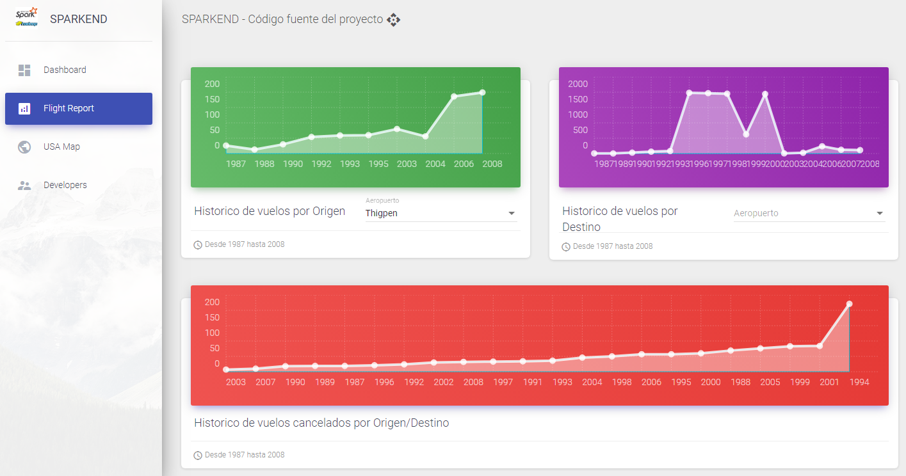

<h1 align="center">SPARKEND</h1>
<p align="center"><i>✨🐘 Web application with Angular-Material for a multinode cluster in SPARK-HADOOP</i></p>
<div align="center">
  <a href="https://github.com/TheWorstOne/Sparkend/stargazers"></a>
<a href="https://github.com/TheWorstOne/Sparkend/network/members"></a>
<a href="https://github.com/TheWorstOne/Sparkend/pulls"></a>
<a href="https://github.com/TheWorstOne/Sparkend/issues"></a>
<a href="https://github.com/TheWorstOne/Sparkend/graphs/contributors"></a>
<a href="https://github.com/TheWorstOne/Sparkend/blob/master/LICENSE"></a>
</div>
<br>
<p align="center"><i>Interested in the project? Please visit my <a href="https://github.com/TheWorstOne/">website</a></i></p>
<br>

<!-- ABOUT THE PROJECT -->
This repository was created as a final project of the Big Data subject at the University of Cuenca. The objective was to demonstrate the knowledge acquired throughout the semester with the development of an application that queries about the data of historical flights of United States airlines. This project was designed to work as a front-end on a lambda architecture implemented with Hadoop-Spark on the backend. Check out the [Demo](https://sparkend-hosting.web.app/)!

<p align="center">
    
</p>

<br>

If you like this Repo, Please click the :star:

<!-- TABLE OF CONTENTS -->
## Contents
  - [Getting Started](#getting-started)
  - [Usage](#usage)
  - [Roadmap](#roadmap)
  - [License](#license)
  - [Contact](#contact)
  - [Acknowledgements](#acknowledgements)

  <!-- GETTING STARTED -->
## Getting Started

To get a local copy up and running follow these steps.

### Prerequisites

List of things that you need to have configured for the correct operation of the project. For more specific details go to [Usage](#usage).
* npm
* Hadoop Distributed File System as a Batch Layer
* SPARK as a Service Layer

### Installation

1. Configure the HDFS and Spark enviroments, check this [doc](https://www.slideshare.net/MiguelAngel1348/cluster-multinodo-en-apache-hadoop-arquitectura-lambda).
2. Clone the repo
   ```sh
   git clone https://github.com/TheWorstOne/Sparkend.git
   ```
3. Install NPM packages
   ```sh
   npm install
   ```

<!-- USAGE EXAMPLES -->
## Usage

In order to hosting the current project in Firebase Hosting Service we need to do several changes into the SPARK backend API. We use static JSON to upload data into the dashboard. Also, the HDFS and SPARK enviroment must be correctly configured.

_For more detail explaination, please check this [doc](https://www.slideshare.net/MiguelAngel1348/cluster-multinodo-en-apache-hadoop-arquitectura-lambda)_

1. Change the endpoint for you master node IP in `src\app\rest.service.ts`
   ```TS
    // Cambiar por API de pyspark
    const endpoint = 'http://25.10.13.68:3200/';
   ```

2. Uncomment these lines in `src\app\rest.service.ts`
   ```TS
    //getDelayCount(arr_dep): Observable<any>{
    getDelayCount(arr_dep): any[]{
        /*
        return this.http.get(endpoint + 'consulta' + arr_dep).pipe(
        map(this.extractData));
        */
        return (arr_dep === "8") ? arr : dep;
    }
   ```
   The code should look like this
   ```TS
    getDelayCount(arr_dep): Observable<any>{
        return this.http.get(endpoint + 'consulta' + arr_dep).pipe(
        map(this.extractData));
    }
   ```
   Repeat the same step for the rest of the services
3. Uncomment these lines in `src\services\query-primera.service.ts`
   ```TS
    //public getConsulta1(): Observable<ConsultaRutas[]> {
    public getConsulta1(): any[] {
        var uri = `http://25.10.13.68:3200/consulta1`;
        /*
        return this.httpClient.get<ConsultaRutas[]>(uri).pipe(
        map(data => data.map(data => new ConsultaRutas().deserialize(data)))
        );
        */
        return q1.map(q1 => new ConsultaRutas().deserialize(q1));
    }
   ```
    The code should look like this
   ```TS
    public getConsulta1(): Observable<ConsultaRutas[]> {
        var uri = `http://25.10.13.68:3200/consulta1`;
        return this.httpClient.get<ConsultaRutas[]>(uri).pipe(
        map(data => data.map(data => new ConsultaRutas().deserialize(data)))
        );
    }
   ```
   Repeat the same step for the rest of the services

4. Now for consuming the services you need to uncomment these lines in `src\app\dashboard\dashboard.component.ts`
   ```TS
    public getConsulta1() {
        /*
        this.queryPrimeraService.getConsulta1().subscribe(_consultaLlegadaRutas => {
        this.consultaRutasLlegada = _consultaLlegadaRutas;
        this.dataSource1.data = _consultaLlegadaRutas;
        });
        */
        this.consultaRutasLlegada = this.queryPrimeraService.getConsulta1();
        this.dataSource1.data = this.queryPrimeraService.getConsulta1();
    }
   ```
   The code should look like this
   ```TS
    public getConsulta1() {
        this.queryPrimeraService.getConsulta1().subscribe(_consultaLlegadaRutas => {
        this.consultaRutasLlegada = _consultaLlegadaRutas;
        this.dataSource1.data = _consultaLlegadaRutas;
        });
    }
   ```
   Repeat the same step for the rest of methods

5. Repeat the same previous process now into `src\app\flight-report\flight-report.component.ts` and `src\app\usa-map\usa-map.component.ts`

<!-- ROADMAP -->
## Roadmap

See the [open issues](https://github.com/TheWorstOne/Sparkend/issues) for a list of proposed features (and known issues).


<!-- LICENSE -->
## License

Distributed under the MIT License. See `LICENSE` for more information.


<!-- CONTACT -->
## Contact

Miguel Ángel Macías - 👨‍💻[Linkedin](https://www.linkedin.com/in/mangelladen/)

My Personal Website: ✨[TBD](https://github.com/TheWorstOne/)


<!-- ACKNOWLEDGEMENTS -->
## Acknowledgements
* [Freddy Abad](https://github.com/FreddieAbad)
* [Jonnathan Campoberde](https://github.com/JonnHenry)
* [Moises Arevalo](https://github.com/MoisesArevalo)


